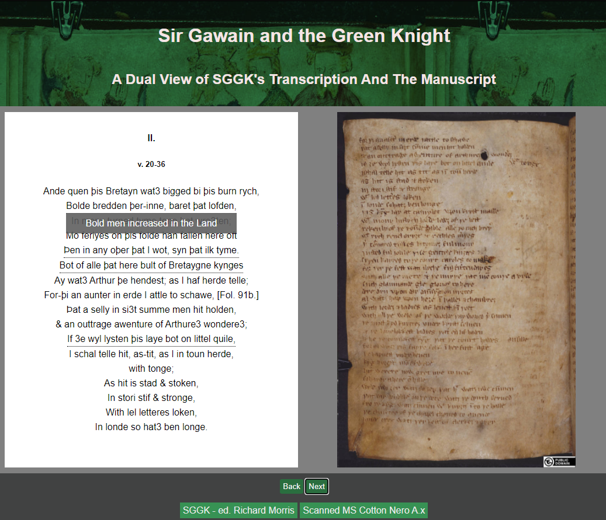

# DualView_TranscriptionVsMS
Assignment for Isaac Pante's class on "Publication numérique"

## Description of the project
The main idea of this script originated from my passion of middle english texts, such as Gawain and the Green Knight, and my curiosity over the paleographical aspects of the text, which was less studied in my litterature classes. Print versions did not include images of the MS Cotton Nero A.x., and SGGK seemed to lack a comparative script or website, which is why, this simple program allows a user to read and compare a SGGK transcription vs the original scanned Manuscript.
* The left side of the program allows users to scroll through on version of SGGK's transcription, adjusted to match the MS's paging.
* The "Back" and "Next" buttons allow the user to change the page and folio in parallel.
* Hovering the mouse over the right side of the program (the folio), scales the image up to be better seen in detail.
## Installation Tips
* The project has to be viewed/read from "index.html".
* One way to view this project is through VSCode's "Live Server" extension.
## Credits
This project uses public domain text, and images from Project Gutenberg, and University of Calgary's Digital Collections respectively.
* http://www.gutenberg.org/ebooks/14568
* http://contentdm.ucalgary.ca/digital/collection/gawain/search
## Context of development
The project was made for the validation of the class "Publication Numérique" taught by Isaac Pante (SLI, Lettres, Unil).
